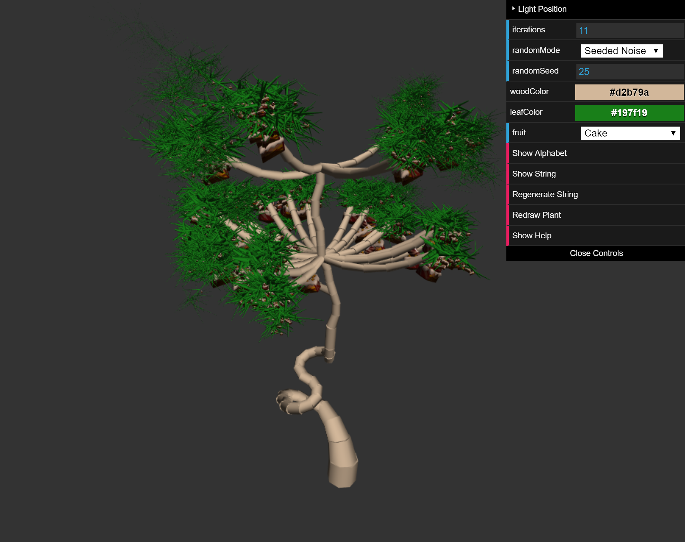
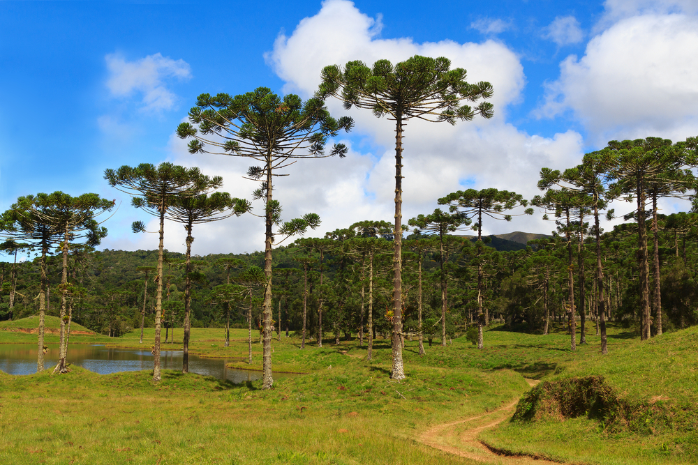
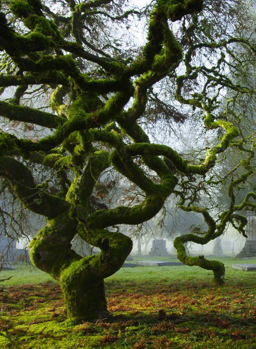

# Homework 4: L-systems

## Student Info

* Name: Mauricio Mutai
* PennKey: `mmutai`

## Demo

Click below to go to the demo!

(Plant created with 11 iterations, seed 25, default colors, non-default fruit, on commit `5dc9eb9`)

## Controls

Below is an explanation of how to use the controls in the demo. A similar explanation of the controls can be accessed by clicking "Show Help" in the demo. Note that, unless otherwise specified, changes will only become visible if you redraw the plant using `Regenerate String and Plant` or `Redraw Plant`.

* `Light Position`: Changes the light position for shading. Updates automatically (redrawing plant is not needed).
* `iterations`: Changes number of times the string is expanded from its axiom.
* `randomMode`: Changes how "random" numbers are generated. The options are `Math.random()` and a deterministic seeded noise function. Using the seeded noise function is recommended if you want to redraw the same plant while tweaking other parameters, such as colors and fruit.
* `randomSeed`: Changes the seed for the deterministic seeded noise function.
* `woodColor`: Changes the color used for the wood geometry.
* `leafColor`: Changes the color for the leaf geometry.
* `fruit`: Changes which decoration is placed on the branches (some non-fruity decorations may require more determination).
* `Show Alphabet`: Shows L-system's alphabet.
* `Show String`: Shows current expanded L-system string.
* `Regenerate String and Plant`: Resets L-system string to axiom, re-expands it, then redraws plant.
* `Redraw Plant`: Redraws plant without modifying L-system string. Note that if your `randomMode` is `Math.random()`, you will get different results, although the general structure of the plant will still be the same. Similarly, using the seeded noise function and changing the seed will lead to different results.
* `Show Help`: Shows a help message.

## Techniques Used

### Overview

* In this demo, I use an L-system in order to place geometry in such a way that it resembles a plant. This geometry is rasterized with a standard WebGL workflow.
* The geometry is placed in one set of VBOs (including vertex positions, normals, and UV coordinates) so it can be rendered with just one draw call.
* I wanted to make a not-so-generic tree. I took inspiration from *araucárias*, a type of tree found in Brazil (as well as Argentina, Chile, and Australia, according to Wikipedia). I wanted to reproduce the unique shape created by their branches that gradually curve upwards as they get farther from the main trunk (see image below).

(Image taken from [here](http://www.mundohusqvarna.com.br/assunto/araucaria-e-possivel-combater-o-risco-de-extincao/))
* My final trees differ from *araucárias* in two significant points:
  * They have fruit. Sometimes, the fruit isn't very fruity. They are models from ["Kirby's Return to Dream Land"](https://www.models-resource.com/wii/kirbysreturntodreamland/model/4572/).
  * They have a base that twists around before righting itself up, instead of just going straight up from the base. This was the result of spending too much time Googling for "trees" and eventually finding "crooked trees", such as the one below. I wanted to reproduce these twisting trunks to give my L-system more variety.

(Image taken from [here](http://www.youramazingplaces.com/incredible-photo-shoots-of-13-cool-places/))

### L-system Overview

* At a high-level: each symbol of my L-system (an `LSymbol`) has a string representation (this allows them to be written as more than one character), an action (e.g. adding geometry, moving the current turtle), and a set of expansion rules.
* The geometry is either a prism or a "decoration", which is the fruit placed under the branches.
* An `LSymbol` may have no expansion rules, in which case it is a terminal symbol and will remain in the string as is.
* The L-system maintains a stack of `Turtles`. At all times, there is at least one `Turtle` in this stack -- the topmost `Turtle` is the active `Turtle`, i.e. the one used to determine where to place geometry. `LSymbols` may modify the active `Turtle` to change its position, orientation, or the thickness of the prisms it draws.
  * Many symbols that add a prism will slightly decrease the turtle's thickness. This has the effect of making the tree thinner the taller it grows.
* The tree's expected structure, from bottom to top, is roughly as follows:
  * A "twisty" trunk at the base that looks like the "crooked tree" above.
  * A "branchy" trunk above the "twisty" trunk. This should be mostly vertical.
    * Araucaria branches should spawn from this "branchy" trunk. The tips of these branches should have leaf-like clusters.

### L-system Alphabet

Below is an explanation of what each symbol in the L-system does, and what they expand to (if they aren't terminal). Unless otherwise specified, "drawing a prism" below will refer to adding one prism using the active turtle's position and orientation, then moving the turtle to the end of this prism.

* `F`: Draws a prism.
* `(f)`: Draws a prism, but moves turtle only 75% of the way to the end of prism. This is useful if the prisms generated by `F` aren't close enough to look connected.
* `(ff)`: Draws a prism, but moves turtle only 82.5% of the way to end of prism. Like `(f)`, this is useful to make prisms look more connected.
* `[`: Pushes a copy of the active turtle onto the stack.
* `]`: Pops a turtle from the stack.
* `(+Z)`: Rotates active turtle along the Z axis with a small positive angle. Used to begin twisting the base of the tree.
* `(pear)`: Draws a decoration at the active turtle's position. There used to be a pear decoration, but now it's gone.
* `(T+Y)`: Rotates active turtle about the Y axis with a small positive angle, then draws a prism. The `T` stands for `Twisty`, as this and `(T-Y)` are used to create the twisting effect at the base of the tree.
    * Usually does not expand.
    * Has a small chance to expand to `(T+Y)(T+Y)`, which makes the trunk twist more in the same direction.
    * Has an even smaller chance to expand to `(T+Y)(T-Y)`, which makes the trunk twist in the opposite direction, straightening it out a little.
* `(T-Y)`: Rotates active turtle about the Y axis with a small negative angle, then draws a prism.
    * Usually does not expand.
    * Has a small chance to expand to `(T-Y)(T-Y)`, which makes the trunk twist more in the same direction.
    * Has an even smaller chance to expand to `(T-Y)(T+Y)`, which makes the trunk twist in the opposite direction, straightening it out a little.
* `(TS)`: No action. This is supposed to be a "twisty start" (also: "twisty seed", "twisty spawner", etc.) in the axiom.
    * Expands to `(T+Y)` or `(T-Y)` with equal probability.
* `(B+x)`: Biases the turtle's orientation upwards, rotates it about the X axis by a small positive angle, then draws a prism. The `B` stands for `branchy`, as this and the other `B` symbols make up the mostly vertical trunk from which the araucaria branches spawn.
    * Has a high chance to expand to `(B+x)(AS)(AS)(AS)`. This introduces new araucaria branches.
    * Has a moderate chance to just not expand.
    * Has a small chance to expand to `(B+x)(B-x)`, making the branchy trunk more straightened out.
    * Has a small chance to expand to `(B+x)(B+y)` or `(B+x)(B-y)`, introducing a new degree of rotation to the trunk.
* `(B-x)`: Like `(B+x)`, but the angle is negative instead.
    * Expands similarly to `(B+x)` -- see source code for specifics.
* `(B+y)`: Like `(B+x)`, but the rotation is done about the Y axis instead.
    * Expands similarly to `(B+x)` -- see source code for specifics.
* `(B-y)`: Like `(B+x)`, but the rotation is done about the Y axis instead and the angle is negative.
    * Expands similarly to `(B+x)` -- see source code for specifics.
* `(BS)`: No action. This is supposed to be a "branchy start" in the axiom.
    * Expands to `(B+x)`, `(B-x)`, `(B+y)`, or `(B-y)` with equal probability.
* `(vert)`: "Vertifies" turtle by repeatedly biasing its orientation upwards and adding prisms. This is used to transition between the "twisty" and "branchy" trunks smoothly, since the "twisty" trunk is expected to be somewhat flat (low Y component), while the "branchy" trunk is supposed to be more vertical (high Y component).
* `(flat)`: "Flatifies" turtle by generating a new orientation for the turtle with a Y component that is slightly negative and randomized X and Z components. Used to start an araucaria branch.
* `(rand)`: "Randifies" (to be consistent with `(vert)` and `(flat)`) the turtle's orientation. Used prior to spawning tips.
* `(AL)`: Similar to `(vert)`, but is much less aggressive when it comes to biasing the turtle's orientation upwards. This is supposed to create the araucaria branches' characteristic shape. The name is supposed to mean "araucaria long", as it is the long part of the branch preceding the tip.
* `(AT)`: Draws a small prism. This is supposed to act like the leaves on the araucaria branches. They became the leaves by accident, as I discovered that they kind of look like leaves when I exaggerate the probability that tips branch into smaller tips.
    * Has a high chance to expand to `(AT)[(rand)(AT)]`, effectively adding one branch.
    * Has a moderate chance to expand to `(AT)(pear)[(rand)(AT)]`, effectively adding one decoration and one branch.
    * Has a small chance to just not expand.
    * Has a very small chance to expand to `(AT)(AT)`, effective growing without branching.
    * Has a very small chance to expand to `(AT)(pear)(AT)`, effective growing without branching, and also adding one decoration.
* `(AS)`: No action. This is supposed to be an "araucaria branch start".
    * Has the most complex/overengineered expansion rules. I will explain these only at a high level.
    * Has a high chance to expand to something like `[(flat)(AL)(pear)(AT)(...)][(flat)(AL)(pear)(AT)(...)]`, where `(...)` stands for many araucaria branches created by nesting strings like `[(rand)(AT)(...)]`.
        * This essentially stimulates the creation of many branches with `(AT)`.
    * Has a small chance to expand to something like `[(flat)(AL)(pear)(AT)(...)](BS)[(flat)(AL)(pear)(AT)(...)]`. Note the added `(BS)` in the middle -- this stimulates araucaria branches growing at different heights of the branchy trunk.

As a bonus, here is the axiom: `(f)(+Z)(f)(+Z)(f)(+Z)(ff)(TS)(vert)F(BS)`. Hopefully it makes sense to you after reading the alphabet specifications above.

## Original README below

For this assignment, you will design a set of formal grammar rules to create
a plant life using an L-system program. Once again, you will work from a
Typescript / WebGL 2.0 base code like the one you used in homework 0. You will
implement your own set of classes to handle the L-system grammar expansion and
drawing. You will rasterize your L-system using faceted geometry. Feel free
to use ray marching to generate an interesting background, but trying to
raymarch an entire L-system will take too long to render!

## L-System Components
The way you implement your L-System is ultimately up to you, but we recommend
creating the following classes / constructs to help you instantiate, expand, and
draw your grammars:
* Some sort of expandable collection of string characters. You might implement
a linked list data structure, or you might use a basic Javascript array (which
is resizeable).
* Some sort of class to represent a Rule for expanding a character into a
string. You might consider creating a map within each Rule that maps
probabilities to strings, so that a Rule can represent multiple possible
expansions for a character with different probabilities.
* A second Rule-style class that dictates what drawing operation should be
performed when a character is parsed during the drawing process. This should
also be a map of probabilities, but this time the values in the map will be
functions rather than strings. Invoke a given function, e.g. `drawBranch`, when
a character is parsed.
* A Turtle class that lets you keep track of, at minimum, a position, an
orientation, and a depth. You should also create a stack onto which you can push
and pop turtle states.
* A class in which to store the VBOs that will represent __all__ of your faceted
geometry. __Do not draw individual mesh components one at a time. This will
cause your program to render very slowly.__ Instead, expand lists of vertex
information as you "draw" your grammar, and push all VBO data to the GPU at once
after you've finished parsing your entire string for drawing.

## OBJ loading
So that you can more easily generate interesting-looking plants, we ask that you
enable your program to import OBJ files and store their information in VBOs. You
can either implement your own OBJ parser, or use an OBJ-loading package via NPM:

[obj-mtl-loader](https://www.npmjs.com/package/obj-mtl-loader)

[webgl-obj-loader](https://www.npmjs.com/package/webgl-obj-loader)

## Aesthetic Requirements
Your plant must have the following attributes:
* It must grow in 3D
* It must have flowers, leaves, or some other branch decoration in addition to
basic branch geometry
* Organic variation (i.e. noise or randomness in grammar expansion)
* A flavorful twist. Don't just make a basic variation on the example broccoli
grammar from the slides! Create a plant that is unique to you!

Feel free to use the resources linked in the slides for inspiration!

## Interactivity
Using dat.GUI, make at least three aspects of your demo an interactive variable.
For example, you could modify:

* The axiom
* Your input grammar rules and their probability
* The angle of rotation of the turtle
* The size or color or material of the cylinder the turtle draws

Don't feel restricted to these examples; make any attributes adjustable that you
want!

## Examples from last year (Click to go to live demo)

Andrea Lin:

Tabatha Hickman:

Joe Klinger:

## Extra Credit (Up to 20 points)
For bonus points, add functionality to your L-system drawing that ensures
geometry will never overlap. In other words, make your plant behave like a
real-life plant so that its branches and other components don't compete for the
same space. The more complex you make your L-system self-interaction, the more
points you'll earn.
